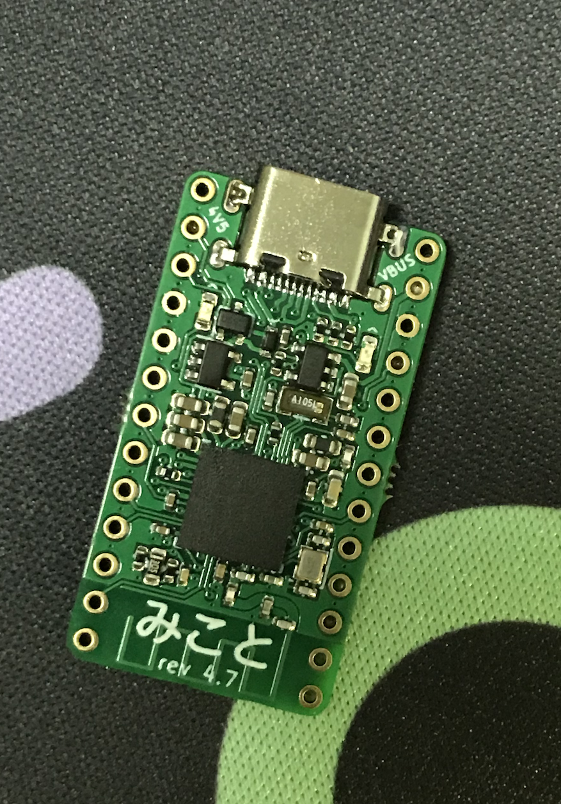

##　みこと

nRF52840 microcontroller, in a pro-micro footprint.

### what

1. VDDH power path (5V USB power, and/or 3.7V Li-ion battery)
2. designed for split keyboards with shared power (currently broken on rev 4.7)
3. ???? literally nothing special

Revision 4.7:

### problems:

#### rev 4.7
1. battery power path is completely broken
2. both LEDs (if they work) are way too bright.
3. antenna needs tuning, but this has to wait; it isn't that bad for now.
4. add a ground pad on the back (along with the `VDD` pad) for SWD programming
5. schottky diode (power path) may or may not overheat...
